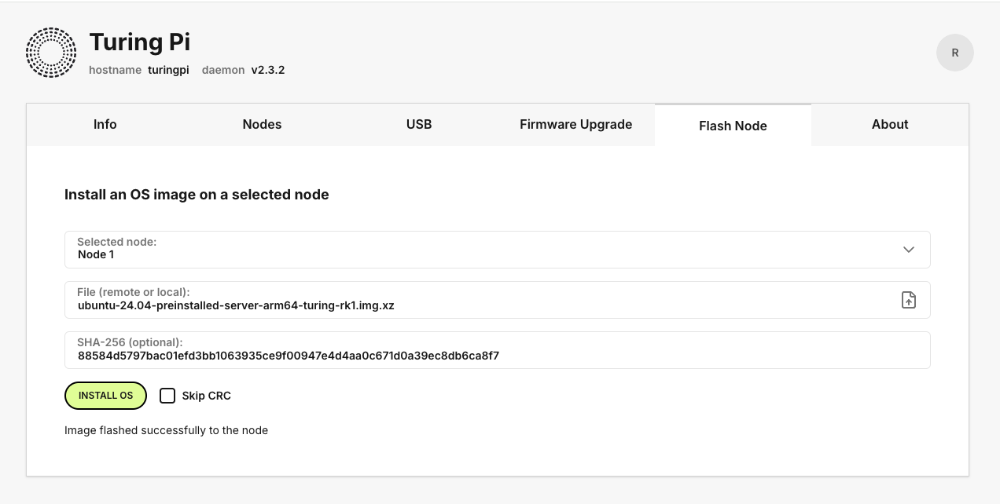

# Turing PI

This page will document the Turing PI setup and configuration. If you don't have this cluster board, this page will not apply to you.

There is a brief overview of the Turing PI that is necessary. This cluster board consists of 5 computers; the BMC (Board Management Controller) and the 4 compute modules. Each of the compute modules in my setup are Turing RK1 SOCs, which are ARM chips that are quite powerful.

Each of these boards are running Ubuntu 24.04 LTS Server with Linux 6.1. Since the RK1 is a Rockchip SBC (single board computer), we need to download the appropriate Ubuntu build for these boards from the community maintained Github repository:

- [Github Repo](https://github.com/Joshua-Riek/ubuntu-rockchip)
- [Turing RK1 Downloads](https://joshua-riek.github.io/ubuntu-rockchip-download/boards/turing-rk1.html)
  - [Ubuntu 24.04 LTS Server with Linux 6.1](https://github.com/Joshua-Riek/ubuntu-rockchip/releases/download/v2.4.0/ubuntu-24.04-preinstalled-server-arm64-turing-rk1.img.xz)
  - [Ubuntu 24.04 LTS Server with Linux 6.1 SHA Checksum](https://github.com/Joshua-Riek/ubuntu-rockchip/releases/download/v2.4.0/ubuntu-24.04-preinstalled-server-arm64-turing-rk1.img.xz.sha256)

# Guides

There are some tricks to working the the Turing PI and it's compute modules that aren't documented very well. This section aims to provide some information about how to perform common operations such as reflashing the OS / changing the boot sequence.

## Connecting to Servers

The way we will connect to the individual compute modules is via SSH. Part of the Ansible setup (in the next section) is to disable password based SSH authentication. It is possible we loose the SSH keys that are registered on the server, and then we may not have a way to connect!

There is a solution, and it is using the UART connection to the compute modules on Turing PI RK1 boards. We can connect just as if we had connected to the server over SSH from the BMC (which has a UART connection to each node):

```bash
# connect to turing pi BMC board
ssh root@turingpi-bmc.local

# ... then connect to the specific node over UART with `picocom` (already installed)
picocom /dev/ttyS1 -b 115200
```

Note that for each Node, the device is mapped as:

- Node 1 = `/dev/ttyS1`
- Node 2 = `/dev/ttyS2`
- Node 3 = `/dev/ttyS3`
- Node 4 = `/dev/ttyS4`

The baud rate (`115200`) will be the same for all Turing PI RK1 boards.

## Flashing OS

Each of the Turing PI RK1 SOCs has a default boot order of `boot_targets=mmc1 nvme scsi usb mmc0 pxe dhcp spi`. What this means is that the boot sequence will check if there is (in order):

- NVMe
- SATA
- USB
- eMMC

This makes it confusing to perform a wipe of the operating system as the first time you install an OS to NVMe for instance, there isn't a straightforward way to boot from another device such as eMMC to reflash the NVMe device. This is an issue because when you flash any of the nodes from the web UI, or from the `tpi` interface when SSHing into the BMC itself - _it will only flash to eMMC_.

This means when it comes time to wipe your NVMe and install a new operating system, there isn't a way to change the boot order from the Ubuntu installation itself. To remedy this is a bit of a complicated process, with any other device we will try to interrupt the boot sequence from startup - however since these nodes are compute modules on a Turing PI board, we can't do that easily.

There are steps to achieve this by creating a pseudo TTY through the UART interface from the BMC to the specific compute node. From here we can restart the node, interrupt the boot sequence, and then change the boot order. After changing the boot order, we can flash the NVMe device with the eMMC installation, and finally we can reboot the machine and verify we have flashed the NVMe and are booting from that device again.

1. Flash the new OS to your device's eMMC

   - (Option 1) Use the Turing PI BMC to flash the OS image to the device. 
   - (Option 2) Flash an image to a USB, plugs the USB-C port called `USB_OTC` with a USB A-C cable. Next SSH into the BMC and flash the image to the node's eMMC:

     ```bash
     ssh root@turingpi-bmc.local # or use the IP address of the BMC directly
     tpi usb -n=1 flash # flash node 1 from USB
     ```

2. After flashing the device and attempting to SSH into your node, you will see nothing has changed. This is because it is still booting from NVMe and we only flashed to the eMMC. We need to change the boot order of the Node 1:

   - Open two terminals, and SSH into the BMC from both of them. From one of these terminals we are going to connect to our Node 1 over the UART interface via `picocom`. After we have signed in we are going to reboot the Node1 from the second terminal, and then we will see an option printed to the screen to interrupt the boot sequence.
     > Don't worry, if you connect over UART - you will not be disconnected when you reboot and will instead see the boot command printed out live!
   - SSH into both devices from separate terminal windows:
     ```bash
     ssh root@turingpi-bmc.local
     ```
   - Connect to Node 1 over UART, here are the commands to connect to each node [straight from Turing PI docs](https://docs.turingpi.com/docs/tpi-uart#using-picocom):
     ```bash
     picocom /dev/ttyS1 -b 115200
     ```
     > The Turing PI docs are pretty outdated, if you have a Turing PI 2.5 board - the nodes are on: Node1=/dev/ttyS1, Node2=/dev/ttyS2, Node3=/dev/ttyS3, Node4=/dev/ttyS4.
   - Now from the second terminal reboot the Node 1 and quickly view the first terminal with the active UART connection. You should see the device booting back up, and when it asks to break the bootprompt - click any key:

     ```bash
     tpi power reset --node=1
     ```

   - You should see an arrow `=>` when the bootup has been stopped. Now you can check the boot targets and move `mmc0` to the front:

     ```bash
     printenv boot_targets # this will return the list of boot_targets
     setenv boot_targets "mmc0 mmc1" # move mmc0 to front
     boot # reboot
     ```

   - After rebooting we will have launched from a fresh install on the eMMC device. We will need to sign in with the default Ubuntu credentials, and then change them to the password we desire. After signing in we will flash the NVMe with the OS from the eMMC. To do this we can use the Rockchip built-in command:

     ```bash
     # after this finishes we can reboot the node
     sudo ubuntu-rockchip-install /dev/nvme0n1

     # ... reboot the node
     sudo reboot
     ```

   - Lets confirm that we are booting from the correct device, first we can `lsblk` all of the devices after SSHing into the node. And then we can confirm that the correct device (idenfitied by the storage size) is present with the second command:

   ```bash
   lsblk # list all devices, we can see one has `emmc` in the name, another has `nvme` in the name.
   df -h # print out the available storage and confirm it matches up with the `nvme` entry
   ```

   - See this video for a full capture of this flashing demo: [Flash Turing PI](./files/02.hardware.turing_pi_rk1.md/turingpi_rk1_flash_os.mp4)
     > Note: This video is stored with Git LFS, clicking the above link won't play the video (as Github doesn't support playing video from LFS), it will download the video. I will plan on putting this video on YouTube in the future.
